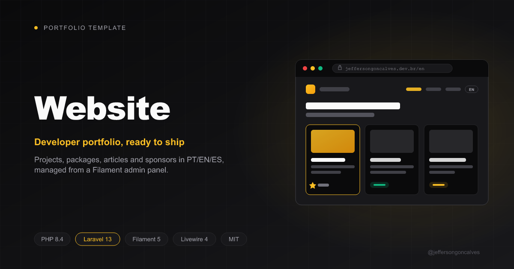

# Website

[](https://packagist.org/packages/jeffersongoncalves/website)
[](https://github.com/jeffersongoncalves/website/actions/workflows/tests.yml)
[](https://github.com/jeffersongoncalves/website/actions/workflows/phpstan.yml)
[](LICENSE)

The source code of [jeffersongoncalves.dev.br](https://jeffersongoncalves.dev.br), the personal
portfolio of **Jefferson Gonçalves** (Full Stack PHP Developer), published as a project template.
It is a multi-language site (PT / EN / ES) that showcases projects, open-source packages, articles
and sponsors, all managed from a Filament admin panel.

It also shows many of my own open-source Laravel and Filament packages working together in a real
app. The `/stack` page lists them all.

## Stack

- **PHP 8.4**, **Laravel 13**, **Filament 5**, **Livewire 4**, **Tailwind CSS 4**
- **Laravel Horizon** (Redis) for queues
- **Pest 4**, **PHPStan** (Larastan, level 7) and **Pint**
- Built on the [FilaKit v5](https://github.com/jeffersongoncalves/filakitv5) starter kit

## Features

- **Localized public site** at `/{locale}` (`pt_BR`, `en`, `es`) with home, about, projects,
  articles, links, open-source, stack and sponsors pages, plus an MCP guide for developers
- **Project pages** that render GitHub READMEs server-side (CommonMark + syntax highlighting),
  sanitized against XSS
- **Live data**: GitHub contributions heatmap and site stats, synced from the GitHub API by queued jobs
- **SEO**: generated `sitemap.xml`, `llms.txt`, Open Graph images and an RSS feed for articles
- **PWA**: manifest, favicons and an offline-capable service worker
- **Hardening**: full-page cache, security headers and SSRF-guarded outbound fetches
- **Admin**: a Filament panel at `/admin` and the Horizon dashboard at `/horizon`, both behind the
  `admin` guard

## Installation

Requirements: PHP 8.4, Composer, [pnpm](https://pnpm.io), and Redis (only needed for Horizon).

```bash
composer create-project jeffersongoncalves/website my-site
cd my-site
touch database/database.sqlite
php artisan migrate
pnpm install
pnpm run build
```

`create-project` copies `.env.example` to `.env` and generates the app key for you. If you work
from a clone instead, run `composer install`, `cp .env.example .env` and `php artisan key:generate`
first.

Start the full dev stack (server, queue worker and Vite):

```bash
composer dev
```

## Quality

```bash
composer phpstan   # static analysis (Larastan, level 7)
composer pint      # code style
./vendor/bin/pest  # tests
```

## Deployment

- `public/build` is not committed, so the deploy has to run `pnpm install && pnpm run build`.
- Production runs on PostgreSQL. It needs Redis with `QUEUE_CONNECTION=redis`, because Horizon
  manages the queues.
- Daily offsite backups (`.env` plus a database dump) go to Google Drive, using
  `spatie/laravel-backup` and
  [`jeffersongoncalves/flysystem-google-drive`](https://github.com/jeffersongoncalves/flysystem-google-drive).

## Versioning

Releases follow the `laravel/framework` version in `composer.lock`. When Laravel is bumped, a
release is tagged automatically with that version (for example `13.33.0`) and
[CHANGELOG.md](CHANGELOG.md) is updated.

## Security

If you find a vulnerability, please don't open a public issue. Report it privately through
[GitHub Security Advisories](https://github.com/jeffersongoncalves/website/security/advisories/new).

## License

The source code is open-sourced under the [MIT license](LICENSE). The site content (texts,
articles, images and branding) remains © Jefferson Gonçalves.
